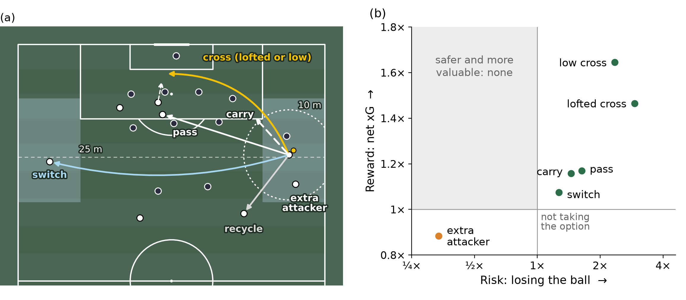

# No Risk, No Reward: Pricing Attacking Options Against the Low Block in Soccer with Graph Attention Networks

Code and aggregate results for our research paper abstract submitted to the MIT Sloan Sports Analytics Conference 2027.



## Summary

Against a set low block, every attacking decision is a trade: a cross or a pass into the block can create a chance,
but it can also give the ball away. We price each option in expected goals (xG). The reward is the xG created over
the rest of the attack. The risk is losing the ball within five seconds and the xG conceded on the counter within
20 seconds.

Teams take an option when it is on, so a raw comparison can overstate its value. A graph attention network (GAT) over
the 22 players and the ball estimates how likely each option was at every decision, and doubly robust estimation
compares decisions where an option was equally likely. On a held-out season the GAT predicts crosses with an AUC of
0.79, against 0.69 from ball position alone.

Out wide, crossing instead of recycling loses the ball 17 more times per 100 five-second decisions, yet adds 0.85 xG
[0.54, 1.18] and concedes no extra xG on the counter. Every option that creates chances also risks the ball, and none
is both safer and more valuable than not taking it.

## Data

We use tracking and event data from 760 Premier League matches (2024/25 and 2025/26). The data are an internal asset
of a European club and cannot be released. This repository contains the method code, the aggregate estimates
reported in the abstract, and the script that draws Figure 1 from those estimates.

## Definitions

- **Low block (SkillCorner):** the average position of the defending team's deepest three players is within its
  defensive third.
- **Set low block (ours):** the three deepest outfield defenders average within 25 m of their goal, at least eight
  outfield defenders are goal-side of the ball, and this holds for 3 s of open play (11 v 11). A moment counts only
  while the block is still within 25 m at the decision.
- **Decision:** each second of an attack against a set low block; the option is what the team does in the next 5 s.
- **Wide decision:** the ball is outside the width of the penalty area, 12 to 35 m from goal.
- **Options:** cross (lofted or low, from the StatsBomb pass height); pass or carry into the block (beyond its
  midfield line); switch (the ball moves at least 20 m across); extra attacker (more attackers than defenders within
  10 m of the ball); recycle (no cross and no pass or carry into the block within 5 s).
- **Outcomes:** xG over the rest of the attack; ball lost within 5 s; opponent xG within 20 s after the attack ends.
  Net xG is xG created minus counter xG conceded.

## Method

- **Choice model** (`lowblock/choice_model.py`): a dense GATv2 network over the 22 players and the ball at the
  decision moment, plus match context, predicting recycle / pass or carry into the block / cross. Trained on one
  season and applied to the other.
- **Equal-likelihood prices** (`lowblock/aipw.py`): augmented inverse probability weighting with cross-fitted
  outcome models (gradient boosting, five folds by match), decisions with a probability below 0.02 for either option
  left out, and 95% intervals from a match-clustered bootstrap. This gives Table 1.
- **Every option** (Figure 1b): each option against not taking it, adjusted for ball position, score, minute, both
  teams' strength, time since the block set, and how the possession started. Every 95% interval excludes 1 on both
  axes.

## Repository

```
lowblock/choice_model.py       graph attention choice model
lowblock/aipw.py               doubly robust prices with a match-clustered bootstrap
results/abstract_results.json  aggregate estimates behind the abstract, Table 1 and Figure 1
figures/make_figure1.py        draws Figure 1 from results/abstract_results.json
figures/figure1.png
```

## Reproducing Figure 1

```
pip install -r requirements.txt
python figures/make_figure1.py
```

## License

MIT
